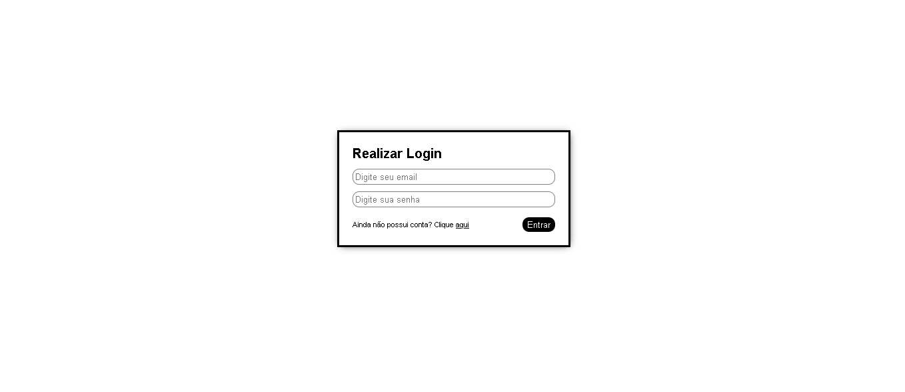

# Projeto 003 - Formulário Único

Resolução do desafio `he4rtlabs-challenges-03` <a href="https://github.com/he4rtlabs/he4rtlabs-challenges-03">Saiba mais</a>.

## Desafio:
Criar dois formulários com transição suave entre eles.

### Resultado Final:

## Aprendizados
- Aprendi um pouco mais sobre animações/transições e como manipulá-las pelo JavaScript.
- Troca de formulários na DOM.
- Evitar carregamento da página após enviar o formulário.

## Tecnologias usadas:
- HTML 5
- CSS 3
- JavaScript